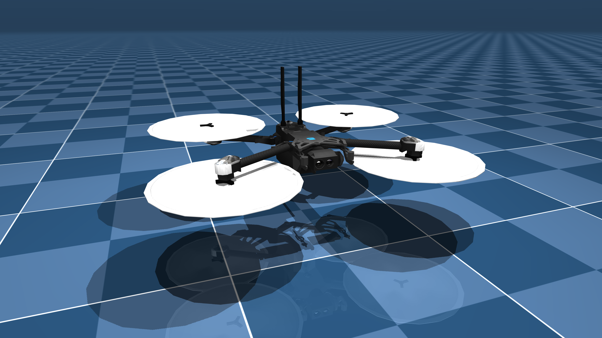

# skydio_x2_description

URDF description of [Skydio X2 quadrotor](https://www.skydio.com/skydio-x2)

It is derived from publicly available [MJCF description](https://github.com/google-deepmind/mujoco_menagerie/tree/main/skydio_x2) and transformed to URDF manually.



## Usage

Model can be easily loaded to various libraries such as [pinocchio](https://github.com/stack-of-tasks/pinocchio).

For proper simulation one should use specific selector matrix pre-multiplying the input vector of the actuators. Input from actuators should be only positive.

```python
import pinocchio as pin
import numpy as np

model = pin.buildModelFromUrdf("urdf/skydio_x2.urdf")
data = model.createData()

# Selector matrix for actuators
selector = np.array(
    [
        [0.0, 0.0, 0.0, 0.0],
        [0.0, 0.0, 0.0, 0.0],
        [1.0, 1.0, 1.0, 1.0],
        [-0.18, 0.18, 0.18, -0.18],
        [0.14, 0.14, -0.14, -0.14],
        [-0.0201, 0.0201, 0.0201, -0.0201],
    ]
)

# joint-space force
qfrc_u = selector @ np.array([tau1, tau2, tau3, tau4])

```

Derivation of the selector matrix is described in this [notebook](selector_derivation.ipynb).

Notice, that much attention is put towards dynymics matching the MuJoCo model, collisions are not considered and will be welcomed as a contribution.
